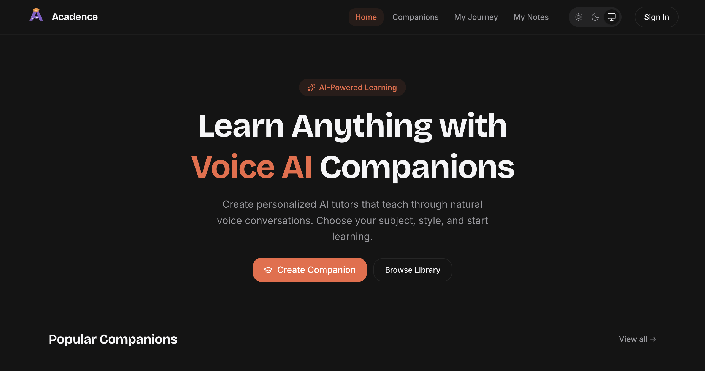

# Acadence

### Learn by talking. Remember by understanding.

An AI-powered learning platform where students learn through natural voice conversations with personalized AI companions.



*(Note: Add screenshots in `docs/screenshots/`)*

## Live Demo

[Visit Acadence](YOUR_DEPLOYED_URL)

## Overview

Traditional LMS platforms often provide static courses, videos, documents, and quizzes, but lack a natural conversational learning experience. Acadence introduces personalized AI companions that allow students to interact with learning material through voice. By talking through concepts, students learn more effectively, and Acadence automatically captures these sessions into structured study notes.

## Core Features

### Current Implementation

- **AI Voice Companions:** Learn by speaking naturally with AI companions powered by Vapi.
- **Personalized Companions:** Companions have distinct names and subjects to tailor the learning experience.
- **Live Conversation & Transcript:** Real-time voice interaction with live captioning of the active conversation.
- **Pause, Resume, and Mute:** Full control over the voice session.
- **Persistent Learning Conversations:** All voice sessions and messages are persisted to the database.
- **AI Learning Notes:** Automatic generation of structured study notes (summary, key concepts, important points, misconceptions) using Google Gemini after a session ends.
- **My Notes Dashboard:** Access, search, and review generated notes from past sessions.
- **Authentication:** Secure user authentication provided by Clerk.
- **Light / Dark Mode:** Complete system-aware theme support.
- **Responsive UI:** Apple-inspired design system with smooth interactions across mobile and desktop.
- **Error / Loading States:** Comprehensive error boundaries and not-found handling.

### Roadmap

- [x] AI voice companions
- [x] Real-time conversation
- [x] Live transcript
- [x] Light/dark theme
- [x] Authentication
- [x] Persistent learning conversations
- [x] AI-generated structured notes
- [x] My Notes dashboard
- [ ] Flashcards
- [ ] AI-generated quizzes
- [ ] Learning analytics
- [ ] Personalized learning memory

## How It Works

```text
Student
   │
   ▼
Acadence Web App
   │
   ├── Clerk Authentication
   │
   ├── Companion Selection
   │
   ▼
Vapi Voice Session
   │
   ├── User Speech
   ├── AI Speech
   └── Live Transcript
   │
   ▼
End of Session
   │
   ├── Persist Conversation (Supabase)
   └── Trigger Note Generation (Gemini)
   │
   ▼
My Notes Dashboard
```

## Architecture

- **Frontend:** Built with Next.js (App Router) and React, styled with Tailwind CSS using an Apple-inspired design aesthetic.
- **Authentication:** Handled entirely by Clerk.
- **Database:** Supabase/PostgreSQL is used to store learning sessions, conversation messages, and generated notes, secured by Row Level Security (RLS).
- **Voice AI:** Vapi provides the real-time voice infrastructure.
- **AI Processing:** Google Gemini is used server-side to generate structured notes from finalized conversation transcripts.
- **Monitoring:** Sentry tracks errors and performance issues.
- **Deployment:** Optimized for Vercel.

## Tech Stack

| Layer          | Technology          | Purpose                     |
| -------------- | ------------------- | --------------------------- |
| Framework      | Next.js (v16.3+)    | Application framework       |
| Language       | TypeScript          | Type safety                 |
| UI             | React (v19)         | Interface components        |
| Styling        | Tailwind CSS (v4)   | Styling and design system   |
| Authentication | Clerk               | User authentication         |
| Database       | Supabase/PostgreSQL | Data persistence & RLS      |
| Voice AI       | Vapi                | Real-time voice interaction |
| AI Generation  | Google Gemini       | Post-session note creation  |
| Monitoring     | Sentry              | Error monitoring            |
| Deployment     | Vercel              | Production hosting          |

## Project Structure

```text
Acadence-LMS-SaaS/
├── app/                  # Next.js App Router (pages, api routes)
│   ├── api/webhooks/vapi # Vapi end-of-call report webhook
│   ├── companions/       # Companion selection and interaction
│   ├── my-journey/       # User journey dashboard
│   ├── notes/            # AI generated notes dashboard
│   └── sign-in/          # Clerk authentication pages
├── components/           # Reusable React components (UI, shared)
├── lib/                  # Utilities, actions, schemas, and AI integration
│   ├── actions/          # Server actions (learning.actions.ts, etc.)
│   ├── ai/               # AI generation logic (generate-notes.ts)
│   └── schemas/          # Zod validation schemas
├── supabase/             # Supabase migrations and configurations
│   └── migrations/       # SQL migrations for learning memory
├── public/               # Static assets
├── .env.example          # Environment variable template
├── package.json          # Dependencies and scripts
└── next.config.ts        # Next.js and Sentry configuration
```

## Getting Started

### Prerequisites

- Node.js (v22+ recommended)
- npm
- Supabase account
- Clerk account
- Vapi account
- Google Gemini API key

### Local Setup

```bash
git clone <repository-url>
cd Acadence-LMS-SaaS

npm install

cp .env.example .env.local
```

Fill in `.env.local` with your credentials, then run:

```bash
npm run dev
```

## Environment Variables

> **⚠️ WARNING:** Never commit `.env`, `.env.local`, API keys, or other secrets to Git.

| Variable | Required | Purpose |
| -------- | -------- | ------- |
| `NEXT_PUBLIC_CLERK_PUBLISHABLE_KEY` | Yes | Clerk client-side publishable key |
| `CLERK_SECRET_KEY` | Yes | Clerk server-side secret key |
| `NEXT_PUBLIC_CLERK_SIGN_IN_URL` | Yes | Path to sign-in page (e.g. `/sign-in`) |
| `NEXT_PUBLIC_CLERK_SIGN_IN_FALLBACK_REDIRECT_URL` | Yes | Fallback redirect after sign-in (e.g. `/`) |
| `NEXT_PUBLIC_SUPABASE_URL` | Yes | URL of your Supabase project |
| `NEXT_PUBLIC_SUPABASE_ANON_KEY` | Yes | Supabase public anonymous key |
| `NEXT_PUBLIC_VAPI_WEB_TOKEN` | Yes | Vapi public web token for voice sessions |
| `GOOGLE_GENERATIVE_AI_API_KEY` | Yes | Server-side Gemini API key for note generation |
| `NEXT_PUBLIC_SENTRY_DSN` | Optional | Sentry client DSN |
| `SENTRY_ORG` | Optional | Sentry organization slug |
| `SENTRY_PROJECT` | Optional | Sentry project name |
| `SENTRY_AUTH_TOKEN` | Optional | Server-side Sentry authentication token |

## Clerk Setup

1. Create an application in [Clerk](https://clerk.com).
2. Obtain the Publishable and Secret keys.
3. Add them to `.env.local`.
4. Ensure the SignIn route in `app/sign-in/` matches your configuration.

## Supabase Setup

1. Create a [Supabase](https://supabase.com) project.
2. Obtain the Project URL and anon key.
3. Add them to `.env.local`.
4. Run the database migration located in `supabase/migrations/001_learning_memory.sql` via the Supabase SQL Editor to create the necessary tables (`learning_sessions`, `conversation_messages`, `learning_notes`) and configure Row Level Security (RLS).

## Vapi Setup

1. Create a [Vapi](https://vapi.ai) account.
2. Obtain your Public Web Token from the Vapi dashboard.
3. Configure your AI Assistant in Vapi (instructions, voice, etc.).
4. Add the Public Web Token to `.env.local` as `NEXT_PUBLIC_VAPI_WEB_TOKEN`.
5. **Webhook Configuration (Optional but Recommended):** Acadence includes a fallback webhook at `app/api/webhooks/vapi/route.ts` to process `end-of-call-report` messages. You can configure this Server URL in the Vapi dashboard to point to `https://your-domain.com/api/webhooks/vapi`.

## Development Commands

| Command | Purpose |
| --- | --- |
| `npm run dev` | Start development server |
| `npm run build` | Production build |
| `npm run start` | Start production server |
| `npm run lint` | Run ESLint |
| `npm run lint:fix` | Run ESLint and fix errors |
| `npm run typecheck` | Run TypeScript type checking |

## Production Build

To test a production build locally:

```bash
npm run build
npm run start
```
*Note: Ensure all environment variables are correctly set before building.*

## Deployment

The project is optimized for deployment on Vercel:

1. Import your GitHub repository into Vercel.
2. Configure all required environment variables in the Vercel dashboard.
3. Vercel will automatically detect Next.js and run `npm run build`.
4. Once deployed, configure the Vapi server URL in the Vapi dashboard to use your new production domain if utilizing webhooks.

## Security

- **Environment Validation:** `lib/env.ts` uses Zod to strictly validate environment variables at startup, failing fast if secrets are missing.
- **Server-Side Secrets:** API keys for Gemini and Clerk are server-side only and never exposed to the client.
- **Authentication:** All protected routes and server actions verify the Clerk user session.
- **Authorization:** Supabase uses Row Level Security (RLS) policies based on the authenticated user's JWT to ensure users can only access their own sessions, messages, and notes.
- **Error Monitoring:** Sentry is integrated for robust error tracking without exposing sensitive details to users.

## Accessibility

- The UI uses Radix UI primitives for accessible interactive components.
- Semantic HTML controls are used for the voice session interface.
- Complete support for system color preferences (reduced eye strain via Dark Mode).

## Known Limitations

- **Flashcards & Quizzes:** Not yet implemented (planned for future releases).
- **Vapi Webhook configuration:** Requires manual setup in the Vapi dashboard; it cannot be provisioned entirely through code at this time.
- **AI Note Generation:** Operates optimally on well-structured conversations; very short or empty sessions may result in limited study notes.

## Contributing

1. Fork the repository
2. Create a feature branch
3. Make your changes
4. Run `npm run typecheck` and `npm run build` to verify
5. Open a pull request

## License

License information has not yet been specified.

## Author

Ayush Bijalwan
